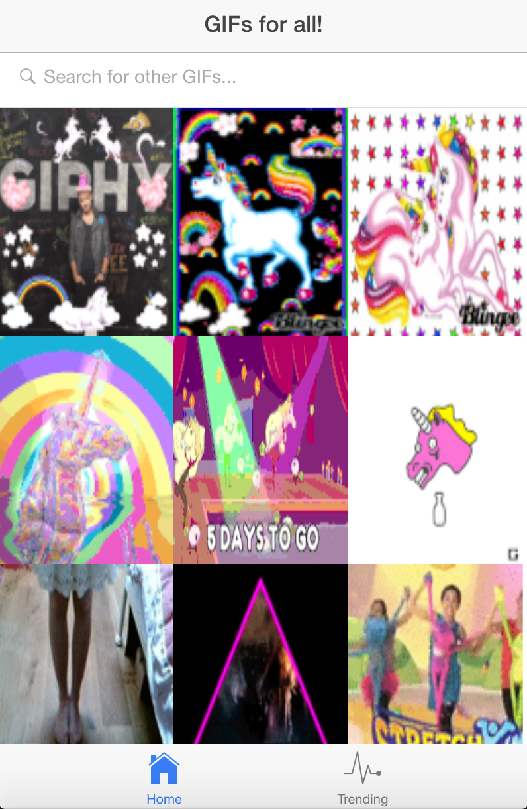

# Gifs-for-all

## Description
A mobile app built using the Ionic framework which enables the development of hybrid mobile apps using HTML5 and AngularJS. The app utilizes the Giphy API to show a user an infinite scrolling list of unicorn gifs. It also allows a user to view trending gifs and search for any gif that they would like.

## Getting Started
1. Clone the repository to your local machine: <tt>git clone https://github.com/KlimekM/gifs-for-all.git</tt>
2. Install the dependencies <tt>npm install</tt>
3. Run the server <tt>ionic serve</tt>
4. Running the server should open up a window with the app. Otherwise, navigate to: <tt>http://localhost:8100/</tt>
5. Resize your browser to mimic the size of a phone (see screenshots below).

## Screenshots

#### Home Page:

#### Trending Gifs:

#### Modal(when an individual Gif is clicked):

